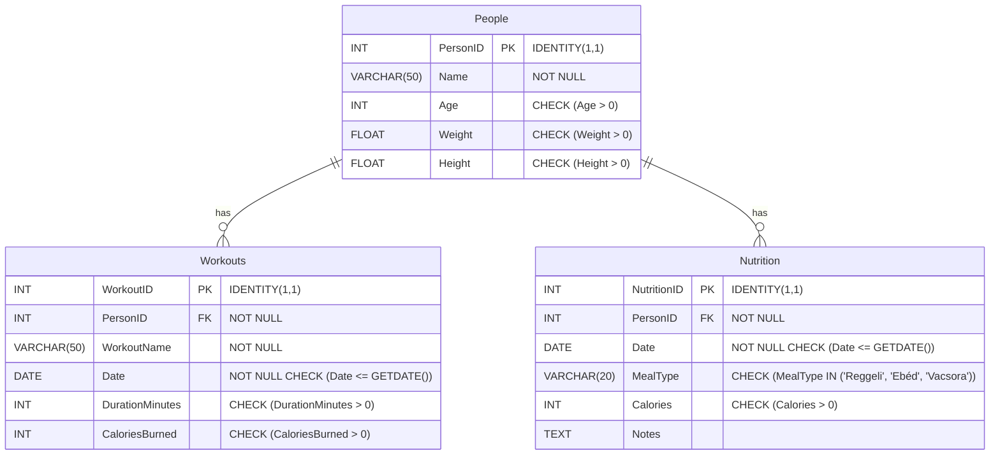

# Pontvadász ZH Árlap

## Borbély Balázs - OACMUT

### A projekt leírása
A program egy egyszerű edzés- és étkezéskövető alkalmazás. Az adatbázisban szereplő személyek edzéseit és étkezéseit tudjuk vele rögzíteni és törölni. A változatosság kedvéért a Windows Forms App-ban az edzéseket, a weblapon és ezáltal az API-n keresztül pedig az étkezéseket tudjuk számontartani. Az adatbázist Azure SQL szerveren hostolom, a táblák adatait pedig a ChatGPT-vel generáltattam.

### Az adatbázis Mermaid ábrája


#### Scaffold parancs
```bash
Scaffold-DbContext "Data Source=oacmut.database.windows.net;Initial Catalog=FitnessDB;User ID=gipszjakab;Password=Password12345;Connect Timeout=30;Encrypt=False;Trust Server Certificate=False" Microsoft.EntityFrameworkCore.SqlServer -OutputDir Models
```

### Windows Forms Application
##### User Interface 


- `1x2p` Az alkalmazásból a **kilépés csak megerősítő kérdés után** lehetséges. 
- `2x1p` **Többablakos alkalmazás** legalább két felugró ablakkal. Minden Form-nak saját osztályon kell alapulnia, és funcionalitással kell rendelkeznie. Az ablakok nyílhatnak gombokkal vagy felső menüből is.
- `1x2p` **Anchorok alkalmazása**: az alkalmazás egészében meg van oldva, hogy az ablak átméretezésekor ki legyen használva a rendelkezésre álló terület.	

**`6 pont`**

##### Tábla adatainak megjelenítése `DataGridView`-ban 

- `1x2p` Adatok  megjelenítése 
- `1x2p` Ha a tábla adatforrása saját osztály.

**`4 pont`**

##### Adatkötés `BindingSource` -on keresztül

- `1x2p` Működő  `BindingSource` 

**`2 pont`**

##### Új rekord rögzítése 
Nem minden constraint-re írtam feltételt (pl. dátum nem lehet jövőbeli), ezért tesztelésnél figyelni kell rá, nehogy elszálljon a program!


- `1x1p` Ha legalább egy nem kulcs mező, pl. _Mennyiség_ is fel van véve
- `1x2p` Ellenőrzéshez kötött adatfelvitel (egyszerű validáció pl: `String.IsNullOrEmpty()`)
- `1x2p` Felugró ablakon keresztül történik _Ok_ és _Mégse_ gombbal
- `1x2p` Ha az űrlap legördülő dobozon vagy listán keresztül beállítható idegen kulcsot is tartalmaz
- `2x1p` A kitöltési hiba `ErrorProvider`-en keresztül kerülnek közlésre a felhasználóval, hibás kitöltés esetén nem enged rányomni az _Ok_ gombra
- `1x2p` `Regex` alapú validáció
- `1x1p` Hibás kitöltés esetén nem lehet megynomni az _Ok_ gombot. 

**`12 pont`**

#####  Rekord törlése 


- `1x2p` Sikeres törlés
- `1x2p` Megerősítéshez kötött törlés

**`4 pont`**

### ASP .NET 

- `1x2p`  `program.cs` beállítása `wwwroot` mappában tárolt statikus tartalmak megosztására

**`2 pont`**

##### API végpontok
Nem minden constraint-re írtam feltételt (pl. dátum nem lehet jövőbeli), ezért a hozzáadás tesztelésénél figyelni kell rá, nehogy elszálljon a program!


- `1x3p` Teljes SQL tábla adatainak szolgáltatása API végponton keresztül 
- `2x2p` SQL tábla egy választható rekordjának szolgáltatása API végponton keresztül
- `1x3p` SQL tábla egy választható rekordjának törlése
- `1x5p` Új rekord felvétele `HttpPost` metóduson keresztül SQL táblába

**`13 pont`**

### Hozott anyagok

Megtalálható a wwwroot mappában, hozott.js néven. Ez csupán az API működését teszi lehetővé a html oldalon. (fetch, stb.)

##### Saját Adatbázis

- `3x1p` Az alkalmazásban használt táblánként pont
- `1x1p` Az adatbázis tartalmaz Constraint-eket (min 2)
- `1x1p` Az adatbázis adatainak forrásmegjelölése értsd: miből készült és hogyan
- `1x2p` Az adatbázis saját Azure SQL szerveren van

**`7 pont`**

##### Weboldal


- `1x1p` A weboldalnak van egy értelmezhető struktúrája
- `1x1p` A weboldal dinamikus tartalommal tölthető fel adatbázison keresztül
- `1x1p` A weboldal javascriptet használ API végpont által szolgáltatott adatok betöltésére, hozott anyagként
- `1x1p` A weboldal javascriptje más funkciót is ellát, mint az adatok betöltése

**`4 pont`**

### Egyéb, extra

- `2x1p`  `Scaffold-DbContext` használata (ajándék)

**`2 pont`**

# Összesen: 56 pont
